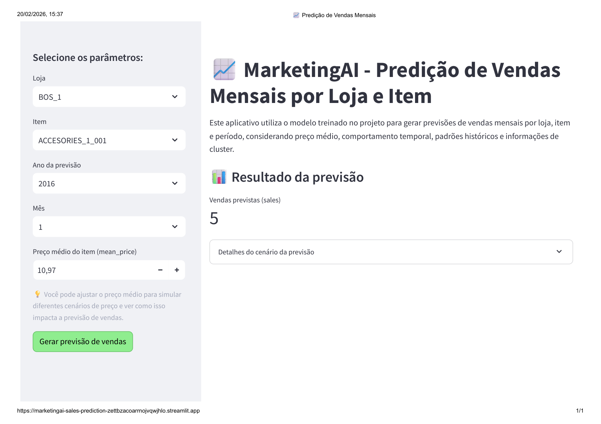

# Marketing_AI – Sistema de Predição de Vendas

## 1. Descrição do Projeto

O **Marketing_AI** é um projeto de Ciência de Dados voltado à **predição de vendas mensais por loja e item** a partir de dados históricos de vendas, preço médio e comportamento temporal. A solução combina **análise exploratória**, **engenharia de atributos**, **clusterização com K-Means**, **modelagem preditiva supervisionada** e uma **interface interativa em Streamlit** para simulação de cenários.

O foco do projeto é transformar dados históricos em apoio prático à decisão, permitindo estimar vendas futuras com base em variáveis como loja, item, período e preço médio.

O projeto foi desenvolvido como parte do Programa de Formação de Cientista de Dados Profissional (CDPro).

## 2. Contexto do Problema e Objetivo do Negócio

O projeto **MarketingAI** foi desenvolvido para atender uma cadeia fictícia de shoppings com o objetivo de apoiar decisões estratégicas por meio da análise preditiva de vendas.

A organização possui diversas lojas distribuídas por regiões distintas, com grande variedade de produtos e histórico extenso de vendas mensais. Esse cenário torna desafiador o entendimento manual do comportamento de vendas e a identificação de padrões relevantes que auxiliem no planejamento comercial.

Diante disso, o projeto busca responder perguntas como:

- Quais padrões de venda podem ser identificados automaticamente?
- Existem grupos de produtos com comportamentos semelhantes?
- Como o preço médio influencia o volume de vendas?
- É possível prever as vendas futuras de forma consistente para apoiar decisões de estoque e estratégia comercial?

## 3. Estrutura do Repositório

```text
marketing_ai-sales-prediction/
│
├── data/
│   ├── raw/                        # dados brutos
│   │   └── base_mensal.csv
│   │
│   └── processed/                  # dados processados
│       ├── df_processed.parquet
│       └── df_com_cluster_id.parquet
│
├── notebooks/                      # registro do projeto em notebooks Jupyter
│   ├── 1_analysis.ipynb            # notebook para análise exploratória e tratamento
│   ├── 2_clustering.ipynb          # notebook para agrupamento
│   └── 3_prediction.ipynb          # notebook para previsão
│
├── artifacts/                      # armazena os objetos serializados usados no app e nos testes
│   ├── kmeans_cluster_model.pkl    # modelo K-Means
│   ├── best_model.pkl              # modelo final treinado para previsão de vendas
│   ├── preprocess_cluster.pkl      # transformador usado antes da predição do cluster
│   └── preprocess_predicao.pkl     # pipeline de pré-processamento da etapa preditiva
│
├── src/                            # contém versões em script Python das etapas centrais
│   ├── 2_clustering.py
│   └── 3_prediction.py
│
├── tests/                          # testes automatizados unitários e de integração
│   ├── unit/
│   │   ├── test_artifacts.py
│   │   └── test_cluster.py
│   └── integration/
│       └── test_data_and_model.py
│
├── app/
│   └── streamlit_app.py            # aplicação Streamlit responsável pela interface de predição
│
├── assets/                         # arquivos visuais
│   └── preview_app.png             # print do app
│
├── pytest.ini                      # configuração do pytest
├── runtime.txt                     # versão do Python, para este projeto Python 3.11
├── requirements.txt                # dependências do projeto
├── .gitignore                      # arquivos e diretórios ignorados pelo Git
├── LICENSE                         # licença do projeto
├── README.md                       # documentação principal do projeto
│
└── .github/                        # automação de CI/CD com GitHub Actions
    └── workflows/
        └── ci.yml                  # workflow para instalação de dependências e execução dos testes
```

## 4. Requisitos

Para executar e reproduzir este projeto, recomenda-se atender aos seguintes requisitos:

- Python 3.11
- `pip` para gerenciamento de pacotes
- ambiente virtual (`venv`) para isolamento das dependências
- dependências listadas no arquivo `requirements.txt`

Esses requisitos são necessários para garantir o funcionamento correto da aplicação, dos testes e do pipeline de predição.

## 5. Instalação

Clone o repositório e acesse a pasta do projeto:

```bash
git clone https://github.com/danieladedavid/marketing_ai-sales-prediction.git
cd marketing_ai-sales-prediction
```

Crie o ambiente virtual:

```bash
py -3.11 -m venv .venv
```

Ative o ambiente virtual no PowerShell:

```powershell
.\.venv\Scripts\Activate.ps1
```

Instale as dependências:

```bash
python -m pip install --upgrade pip
python -m pip install -r requirements.txt
```

Após a instalação, o projeto estará pronto para execução dos testes e uso da aplicação Streamlit.

## 6. Testes

O projeto possui testes automatizados implementados com `pytest`.

### Testes unitários

Validam componentes isolados, como:

- existência dos artefatos;
- carregamento dos arquivos `.pkl`;
- funcionamento da previsão de cluster.

### Testes de integração

Validam o funcionamento conjunto entre:

- leitura dos dados processados;
- carregamento do preprocessador e do modelo;
- cálculo de features históricas;
- execução da predição final.

## 7. Uso (como executar o app)

Com a `.venv` ativa:

```bash
streamlit run app/streamlit_app.py
```

O app permite ao usuário selecionar variáveis como loja, item, ano e mês da previsão. O preço médio é automaticamente sugerido com base no histórico da combinação loja-item escolhida, permanecendo editável para simulação de diferentes cenários. Após a solicitação da previsão, o resultado é exibido na interface juntamente com informações auxiliares, como cluster estimado e médias históricas, contribuindo para uma interpretação mais contextualizada do cenário analisado.

## 8. Metodologia

O projeto foi desenvolvido de forma exploratória e iterativa, passando por etapas de análise exploratória, tratamento dos dados, engenharia de atributos, clusterização e modelagem preditiva.

Foram criadas variáveis temporais como `time_index`, `month_sin` e `month_cos` para representar tendência e sazonalidade. Além disso, a clusterização foi utilizada como etapa de aprendizado não supervisionado para gerar a variável `cluster_id`, posteriormente incorporada como atributo adicional no modelo supervisionado de previsão de vendas.

Os artefatos do pipeline foram salvos em arquivos `.pkl` e integrados a uma aplicação em Streamlit, garantindo consistência entre treino e inferência. O projeto também foi validado com testes unitários e de integração.

## 9. Resultados

O projeto resultou em uma aplicação funcional de previsão de vendas mensais, integrando preprocessamento, clusterização, modelo supervisionado e interface interativa.

Entre os principais resultados, destacam-se a construção de um pipeline reprodutível, o uso da clusterização como variável explicativa adicional, a disponibilização de previsões em Streamlit e a validação do fluxo com testes automatizados.

### Desempenho dos Modelos Avaliados

| Modelo | RMSE | MAE | R² |
|---|---:|---:|---:|
| Ridge (baseline) | 43.56 | 16.81 | 0.736 |
| RandomForest | 44.82 | 17.38 | 0.721 |
| LightGBM | 49.69 | 18.24 | 0.657 |
| XGBoost | 50.05 | 18.42 | 0.652 |

Considerando as métricas avaliadas, o modelo Ridge (baseline) apresentou o melhor desempenho geral entre os modelos testados, com menor RMSE, menor MAE e maior R². Esse resultado sugere que, para o conjunto de dados e para as variáveis utilizadas no projeto, uma abordagem mais simples e regularizada foi suficiente para capturar bem o comportamento das vendas, superando modelos mais complexos como RandomForest, LightGBM e XGBoost.

## 10. Deploy da Aplicação

Para publicar no **Streamlit Community Cloud**:

a. Suba todo o repositório no GitHub  
b. Acesse [Streamlit Community Cloud](https://streamlit.io/cloud)  
c. Conecte sua conta ao GitHub  
d. Selecione este repositório  
e. Defina o arquivo principal: `app/streamlit_app.py`

A aplicação foi implantada utilizando o Streamlit Community Cloud.

Para garantir compatibilidade com as bibliotecas utilizadas, especialmente `pyarrow`, o ambiente de execução foi configurado para utilizar **Python 3.11**, conforme definido no arquivo `runtime.txt` e nas configurações avançadas da plataforma.

O deploy é realizado automaticamente a partir do repositório GitHub.

Abaixo segue o preview do app:



## 11. CI/CD com GitHub Actions

O projeto utiliza GitHub Actions para automatizar a integração contínua (CI), executando a instalação das dependências e os testes a cada atualização no repositório. A etapa de entrega contínua (CD) é complementada pelo deploy automático da aplicação no Streamlit Community Cloud, a partir da branch principal.

## 12. Contribuição

Contribuições são bem-vindas para aprimorar o projeto em diferentes frentes, como organização do código, melhorias no pipeline de dados, expansão dos testes, comparação com novos modelos preditivos, aperfeiçoamento da interface em Streamlit e evolução da documentação. Sugestões, correções e propostas de melhoria podem ser feitas por meio de issues ou pull requests.

## 13. Autora

**Daniela de David**  
Projeto desenvolvido como parte do Programa de Formação Cientista de Dados Profissional (CDPro), com o objetivo de aplicar técnicas de ciência de dados e machine learning em um problema de negócio realista.

## 14. Licença

Este projeto está licenciado sob a **MIT License**, permitindo uso, modificação e distribuição com preservação dos créditos autorais.

## 15. Agradecimentos

- Ao Programa de Formação CDPro (Cientista de Dados Profissional), que tem como grande Mestre Eduardo Rocha.
- À comunidade open source (`pandas`, `scikit-learn`, `streamlit` etc.), cujas bibliotecas e ferramentas tornaram este trabalho possível.